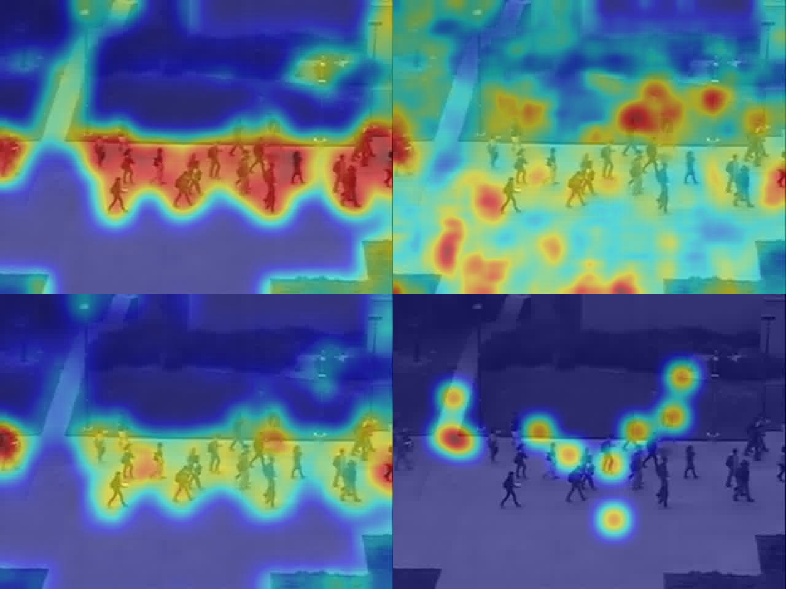

The results reported in [J. Wang et al. Fixation Prediction in Videos using Unsupervised Hierarchical Features. CVPRW'17.](http://openaccess.thecvf.com/content_cvpr_2017_workshops/w37/papers/Wang_Fixation_Prediction_in_CVPR_2017_paper.pdf) was generated with [compute_globalSaliency_video2img_onlymr.m](./compute_globalSaliency_video2img_onlymr). 

One can find some pre-trained temporal ISA bases at [./bases](./bases), which were trained on random Youtube videos. Frame-by-frame images acquired from videos in ASCMN dataset are required to make evaluation, which can be downloaded at [this link to Google's drive](https://drive.google.com/open?id=16HuPcK-5YQiMMIRmMULTLqMrS5FgzDml). Please unzip the downloaded .zip file, and place those files at [./videos](./videos), i.e.

```
	./videos
		+video1
		+video2
		+video2
		...
		...
		+video24
```

An example to run [compute_globalSaliency_video2img_onlymr.m](./compute_globalSaliency_video2img_onlymr) is 

```
	compute_globalSaliency_video2img_onlymr(1, 7, 7, 0.1)
```
which evaluates `video1` with `temporal widths` of the first and second ISA layers being `7`, and `sigma` used in spatial prior being `0.1`. Results will be stored in [./results](./results) (We have provided some results there).

<p align="center">

</p>
From top to bottom, left to right: local saliecy only, global saliency only, combined saliency with spatial prior, ground-truth fixation.
